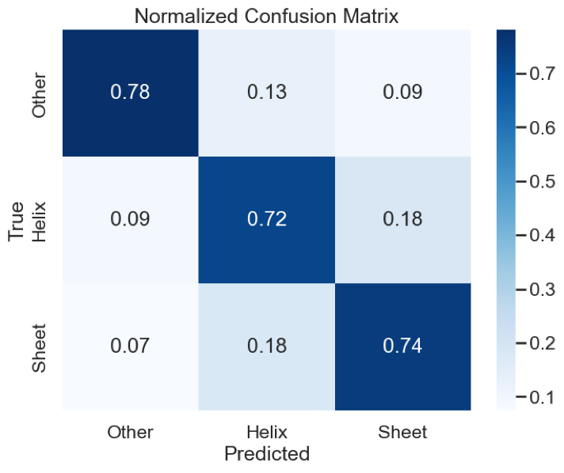
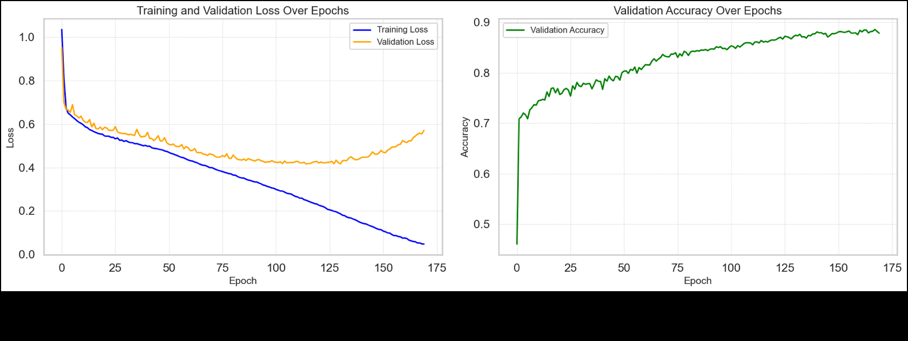

# Protein Secondary Structure Prediction using Deep Learning and Hidden Markov Models

**Author:** Michele Copetti
**Course:** Interdisciplinary Research Methods in Computational Biology
**Date:** June 2024

## Table of Contents

- [Introduction](#introduction)
- [Project Overview](#project-overview)
- [Methods](#methods)
  - [Data Preprocessing](#data-preprocessing)
  - [LSTM Networks](#lstm-networks)
  - [Hidden Markov Models](#hidden-markov-models)
- [Implementation](#implementation)
- [Results](#results)
- [Discussion](#discussion)
- [Conclusion](#conclusion)
- [Usage](#usage)
- [References](#references)

---

## Introduction

Proteins are essential macromolecules that play a critical role in virtually all biological processes. The function of a protein is inherently linked to its three-dimensional structure, which is determined by its amino acid sequence. Understanding protein structure is fundamental to fields such as biochemistry, molecular biology, and medicine.

The **secondary structure** of proteins, which includes **alpha helices (H)**, **beta sheets (E)**, and **other/coil structures (C)**, serves as the building blocks for the tertiary structure, influencing how the protein folds and interacts with other molecules. Accurate prediction of protein secondary structure is therefore a crucial step in determining protein function and designing novel therapeutics.

### Motivation

Despite significant advances in experimental techniques like X-ray crystallography, nuclear magnetic resonance (NMR) spectroscopy, and cryo-electron microscopy, determining protein structures experimentally remains:
- **Time-consuming**
- **Expensive**
- **Technically challenging**

As a result, there is substantial interest in developing computational methods to predict protein structures from amino acid sequences. Computational prediction not only accelerates the pace of discovery but also makes structural insights accessible for proteins that are difficult to study experimentally.

---

## Project Overview

This project implements and compares two distinct computational approaches for predicting protein secondary structure:

### 1. **Deep Learning Approach**
- Utilizes **Long Short-Term Memory (LSTM) networks**
- Leverages the sequential nature of amino acid sequences
- Captures long-range dependencies in protein sequences
- **Accuracy achieved:** 88%

### 2. **Probabilistic Approach**
- Employs **Hidden Markov Models (HMM)**
- Uses the **Baum-Welch algorithm** (a specialized Expectation-Maximization algorithm)
- Provides interpretable probabilistic modeling
- **Accuracy achieved:** 76%

Both models were **implemented from scratch** to ensure a deep understanding of the underlying algorithms and mathematical concepts.

---

## Methods

### Data Preprocessing

The dataset used for this project is the [Protein Secondary Structure Dataset](https://www.kaggle.com/datasets/alfrandom/protein-secondary-structure) by Alf Random, available on Kaggle. It contains protein sequences with corresponding secondary structure labels. The preprocessing pipeline includes:

1. **Filtering**: Remove sequences containing non-standard amino acids
2. **Sequence Parsing**: Extract segments of fixed length (target length: 7 residues)
   - Alpha helices and beta sheets typically range from 7-12 residues
3. **Label Processing**: Assign a single label per sequence segment
4. **Data Encoding**:
   - **For LSTM**: One-hot encoding of amino acids (20-dimensional vectors)
   - **For HMM**: Integer encoding of amino acids (0-19)
5. **Train-Test Split**:
   - **LSTM**: 60% training, 20% validation, 20% testing
   - **HMM**: 80% training, 20% testing

### LSTM Networks

Long Short-Term Memory (LSTM) networks are a specialized type of Recurrent Neural Network (RNN) designed to model sequential data and handle long-range dependencies.

#### LSTM Architecture


An LSTM cell consists of:

1. **Cell State (Ct)**: Long-term memory
2. **Hidden State (Ht)**: Short-term memory
3. **Input Gate (It)**: Controls what new information to add
4. **Forget Gate (Ft)**: Controls what to remove from memory
5. **Output Gate (Ot)**: Controls what to output

#### Mathematical Formulation

**Forget Gate:**
```
ft = σ(Wf · [Ht−1, Xt] + bf)
```

**Input Gate:**
```
It = σ(Wi · [Ht−1, Xt] + bi)
C̃t = tanh(WC · [Ht−1, Xt] + bC)
```

**Cell State Update:**
```
Ct = ft · Ct−1 + It · C̃t
```

**Output Gate:**
```
Ot = σ(Wo · [Ht−1, Xt] + bo)
Ht = Ot · tanh(Ct)
```

#### Model Configuration

- **Input Dimension**: 20 (one-hot encoded amino acids)
- **Hidden Dimension**: 140
- **Number of Layers**: 6
- **Output Dimension**: 3 (Helix, Sheet, Other)
- **Loss Function**: Cross-Entropy Loss
- **Optimizer**: Adam (learning rate: 10⁻⁴)
- **Batch Size**: 100
- **Epochs**: 175

### Hidden Markov Models

Hidden Markov Models (HMM) are statistical models that describe systems transitioning between hidden states over time, making them well-suited for sequence analysis.

#### HMM Components

An HMM is defined by:

- **States (S)**: Hidden states representing secondary structures {H, E, C}
- **Observations (V)**: Amino acid sequences
- **Transition Probabilities (A)**: P(st+1 = sj | st = si)
- **Emission Probabilities (B)**: P(Ot = vk | st = sj)
- **Initial State Probabilities (π)**: P(s1 = si)

#### Baum-Welch Algorithm

The Baum-Welch algorithm is an Expectation-Maximization (EM) algorithm that iteratively refines HMM parameters:

**E-Step (Expectation):**
1. **Forward Algorithm**: Calculate α(i,t) - probability of sequence up to time t
2. **Backward Algorithm**: Calculate β(i,t) - probability from time t+1 to end
3. **Compute γ(i,t)**: Expected state occupancy
4. **Compute ξ(i,j,t)**: Expected state transitions

**M-Step (Maximization):**
Update parameters based on expected counts:
```
aij = Σ ξt(i,j) / Σ γt(i)
bi(k) = Σ γt(i)·δ(ot=k) / Σ γt(i)
πi = γ1(i)
```

#### HMM Training Strategy

Instead of predicting labels for each position, this implementation uses a **sequence-level classification** approach:

1. Train **three separate HMMs**, one for each class (H, E, C)
2. Each HMM has 3 hidden states with class-specific parameters
3. For prediction, compute likelihood of test sequence under each HMM
4. Assign label corresponding to HMM with highest likelihood

---

## Implementation

All code is implemented from scratch in Python using:
- **PyTorch** for LSTM implementation
- **NumPy** for HMM implementation and numerical computations
- **Pandas** for data manipulation
- **Matplotlib & Seaborn** for visualization
- **scikit-learn** for evaluation metrics

The complete implementation can be found in [`main.ipynb`](main.ipynb).

### Key Implementation Details

**LSTM Model:**
```python
class Model(nn.Module):
    def __init__(self, input_dim, hidden_dim, layer_dim, output_dim):
        super(Model, self).__init__()
        self.hidden_dim = hidden_dim
        self.layer_dim = layer_dim
        self.lstm = nn.LSTM(input_dim, hidden_dim, layer_dim, batch_first=True)
        self.fc = nn.Linear(hidden_dim, output_dim)

    def forward(self, x):
        output, (hn, cn) = self.lstm(x)
        out = self.fc(output[:, -1, :])
        return out
```

**HMM Training:**
```python
class HMM:
    def __init__(self, num_states, num_symbols):
        # Initialize transition, emission, and initial probabilities

    def forward_algorithm(self, seq):
        # Calculate forward probabilities

    def backward_algorithm(self, seq):
        # Calculate backward probabilities

    def expectation_step(self, seq):
        # Compute gamma and xi

    def train(self, sequences, num_iterations=1000):
        # Baum-Welch iterations
```

---

## Results

### Performance Metrics

#### Deep Learning (LSTM)

| Metric | Value |
|--------|-------|
| **Precision** | 0.88 |
| **Recall** | 0.88 |
| **F1-Score** | 0.88 |
| **Accuracy** | 0.88 |

**Per-Class Performance:**
| Class | Precision | Recall | F1-Score | Support |
|-------|-----------|--------|----------|---------|
| Other (C) | 0.90 | 0.90 | 0.90 | 2944 |
| Helix (H) | 0.81 | 0.79 | 0.80 | 1217 |
| Sheet (E) | 0.88 | 0.88 | 0.88 | 2260 |

#### Hidden Markov Model

| Metric | Value |
|--------|-------|
| **Precision** | 0.78 |
| **Recall** | 0.76 |
| **F1-Score** | 0.76 |
| **Accuracy** | 0.76 |

**Per-Class Performance:**
| Class | Precision | Recall | F1-Score |
|-------|-----------|--------|----------|
| Other (C) | 0.78 | 0.78 | 0.78 |
| Helix (H) | 0.74 | 0.72 | 0.73 |
| Sheet (E) | 0.78 | 0.74 | 0.76 |

### Confusion Matrices

#### LSTM Model


The LSTM model shows strong performance across all classes, with the highest accuracy for the "Other" class (0.90). The model demonstrates good discrimination between all three secondary structure types.

#### HMM Model


The HMM approach shows decent performance but with more misclassifications, particularly for the Helix class (0.72). The model struggles more with distinguishing between similar structural elements.

### Training Dynamics



The training curves show:
- **Training Loss**: Steadily decreases over epochs, indicating effective learning
- **Validation Loss**: Increases slightly after ~100 epochs, suggesting minor overfitting
- **Validation Accuracy**: Continues to improve throughout training, reaching ~0.88 after 175 epochs

Despite the increase in validation loss, the validation accuracy continues to improve, indicating that the model retains good generalization capabilities.

---

## Discussion

### Model Comparison

#### LSTM Strengths:
- **Higher Accuracy**: Achieves 88% vs 76% for HMM
- **Better Pattern Recognition**: Effectively captures complex sequential patterns
- **Superior Performance**: Particularly strong on Helix and Sheet classification

#### LSTM Limitations:
- **Black-box Nature**: Difficult to interpret learned representations
- **Computational Cost**: Requires significant GPU resources and training time
- **Data Requirements**: Needs large amounts of labeled data

#### HMM Strengths:
- **Interpretability**: Parameters have clear probabilistic meanings
- **Computational Efficiency**: Fast training and prediction
- **Theoretical Foundation**: Well-understood mathematical framework
- **Semi-supervised Learning**: Can work with partially labeled data

#### HMM Limitations:
- **Lower Accuracy**: 76% vs 88% for LSTM
- **Model Assumptions**: Markov assumption may be too restrictive
- **Feature Engineering**: Requires careful design of states and observations

### Key Insights

1. **Deep Learning Advantage**: The LSTM's ability to learn hierarchical representations gives it a significant performance edge

2. **Interpretability Trade-off**: While HMMs provide interpretable results, LSTMs deliver superior predictive power

3. **Overfitting Behavior**: The LSTM shows signs of overfitting (increasing validation loss) but maintains strong generalization (increasing validation accuracy)

4. **Class Imbalance**: Both models perform best on the "Other" class, which is the most common in the dataset

---

## Conclusion

This project successfully demonstrates two fundamentally different approaches to protein secondary structure prediction:

### Main Findings

1. **LSTM networks outperform HMMs** in predictive accuracy (88% vs 76%)
2. **Both approaches are viable** for protein structure prediction
3. **Implementation from scratch** provides deep insights into algorithmic mechanics
4. **Trade-offs exist** between interpretability (HMM) and accuracy (LSTM)

### Choice of Method

The choice between LSTM and HMM should consider:
- **For maximum accuracy**: Use LSTM-based deep learning
- **For interpretability**: Use HMM with Baum-Welch
- **For limited data**: HMMs may be more robust
- **For computational constraints**: HMMs are more efficient

### Future Directions

1. **Hybrid Approaches**: Combine LSTM accuracy with HMM interpretability
2. **Advanced Architectures**: Explore bidirectional LSTMs, attention mechanisms, or transformers
3. **Tertiary Structure**: Extend methods to predict 3D protein structure
4. **Ensemble Methods**: Combine multiple models for improved predictions
5. **Transfer Learning**: Leverage pre-trained models (e.g., ProtBERT, ESM)

---

## Usage

### Requirements

```bash
pip install numpy pandas matplotlib seaborn torch scikit-learn
```

### Running the Code

1. **Clone or download this repository**

2. **Download the dataset**: [Protein Secondary Structure Dataset](https://www.kaggle.com/datasets/alfrandom/protein-secondary-structure)

3. **Update the file path** in the notebook:
```python
path = 'path/to/your/2018-06-06-ss.cleaned.csv'
```

4. **Run the Jupyter notebook**:
```bash
jupyter notebook main.ipynb
```

### Training the LSTM Model

```python
# Define preprocessing
preprocessor = Preprocessing(target_length=7, secondary_type='sst3')
sequences, labels = preprocessor.preprocess_data(path, num_sequences=40000)

# Create model
model = Model(input_dim=20, hidden_dim=140, layer_dim=6, output_dim=3)
criterion = nn.CrossEntropyLoss()
optimizer = optim.Adam(model.parameters(), lr=0.0001)

# Train for 175 epochs
# See notebook for complete training loop
```

### Training the HMM Model

```python
# Preprocess data for HMM
preprocessor = Preprocessing(target_length=7, secondary_type='sst3')
sequences, labels = preprocessor.preprocess_data(path, num_sequences=50000)

# Train three separate HMMs
hmm_helix = HMM(num_states=3, num_symbols=20)
hmm_sheet = HMM(num_states=3, num_symbols=20)
hmm_other = HMM(num_states=3, num_symbols=20)

# Train each HMM on class-specific sequences
hmm_helix.train(helix_sequences, num_iterations=1000)
hmm_sheet.train(sheet_sequences, num_iterations=1000)
hmm_other.train(other_sequences, num_iterations=1000)
```

---

## References

1. Hochreiter, S., & Schmidhuber, J. (1997). Long short-term memory. *Neural Computation*, 9(8), 1735-1780.

2. Eddy, S. R. (2004). What is a hidden Markov model? *Nature Biotechnology*, 22(10), 1315-1316.

3. Murphy, K. P. (2012). *Machine learning: a probabilistic perspective*. MIT Press.

4. Olah, C. (2015). Understanding LSTM Networks. [https://colah.github.io/posts/2015-08-Understanding-LSTMs/](https://colah.github.io/posts/2015-08-Understanding-LSTMs/)

5. Jumper, J., et al. (2021). Highly accurate protein structure prediction with AlphaFold. *Nature*, 596(7873), 583-589.

6. Dataset: [Protein Secondary Structure Dataset](https://www.kaggle.com/datasets/alfrandom/protein-secondary-structure) by Alf Random

7. Wikipedia. (2024). Baum-Welch algorithm. [https://en.wikipedia.org/wiki/Baum–Welch_algorithm](https://en.wikipedia.org/wiki/Baum–Welch_algorithm)

8. Wikipedia. (2024). Hidden Markov model. [https://en.wikipedia.org/wiki/Hidden_Markov_model](https://en.wikipedia.org/wiki/Hidden_Markov_model)

---

## Project Structure

```
CB_Project/
│
├── main.ipynb                 # Main Jupyter notebook with all implementations
├── Report_CB.pdf              # Comprehensive project report
├── Project_HMM.pdf            # Detailed explanation of Baum-Welch algorithm
├── README.md                  # This file
│
└── images/                    # Figures extracted from report
    ├── lstm_architecture.png
    ├── confusion_matrix_dl.png
    ├── confusion_matrix_hmm.png
    └── training_dynamics.png
```

---

## Acknowledgments

This project was completed as part of the "Interdisciplinary Research Methods in Computational Biology" course. Special thanks to the course instructors and the creators of the protein secondary structure dataset.

---

## License

This project is for educational purposes. Please cite appropriately if you use any part of this work.

---

**Contact**: Michele Copetti
**Date**: June 2024
